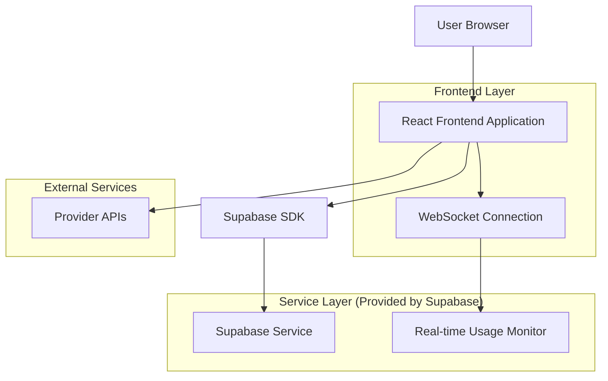
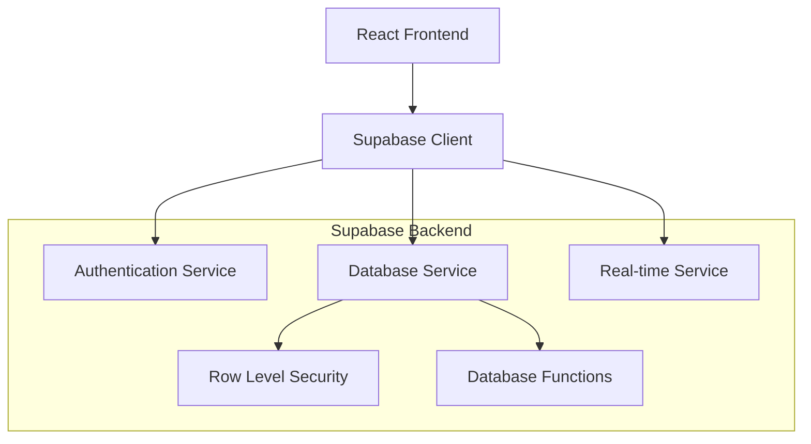
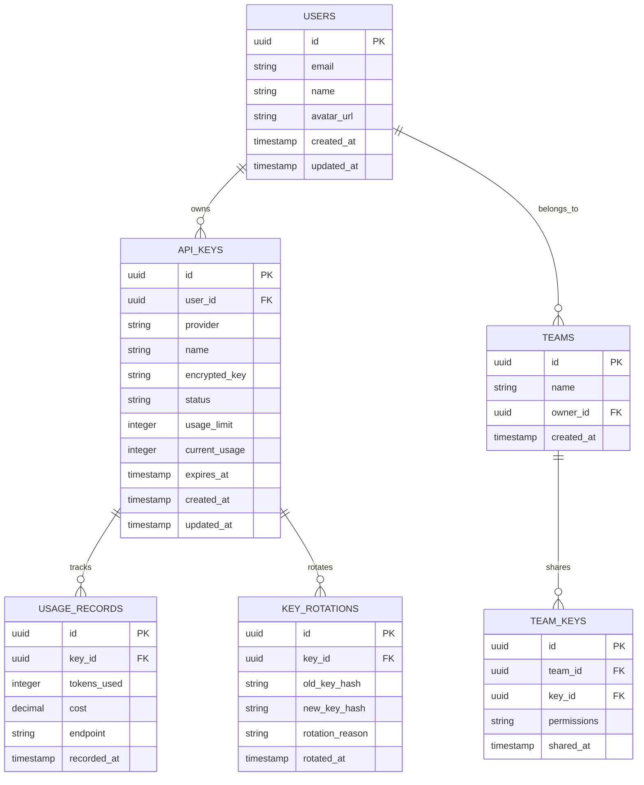

## 1. Architecture design



## 2. Technology Description
- Frontend: React@18 + TypeScript + Tailwind CSS@3 + Vite
- Backend: Supabase (Authentication, Database, Real-time)
- State Management: Zustand for client state
- Charts: Chart.js for usage analytics
- Icons: Lucide React + Provider logos
- Clipboard: Navigator Clipboard API
- Real-time: Supabase Real-time subscriptions

## 3. Route definitions
| Route | Purpose |
|-------|---------|
| / | Dashboard home with usage overview and quick actions |
| /keys | Key management interface for adding, editing, and rotating keys |
| /analytics | Usage analytics with charts and cost optimization |
| /providers | Provider directory with links and integration guides |
| /settings | Application settings, team management, and security |
| /docs | Documentation, recreation prompts, and API reference |

## 4. API definitions
### 4.1 Core API

**Key Management**
```
GET /api/keys
```
Response:
| Param Name | Param Type | Description |
|------------|------------|-------------|
| keys | Array<ApiKey> | List of user's API keys |
| total_usage | number | Total usage across all keys |
| active_keys | number | Number of active keys |

```
POST /api/keys
```
Request:
| Param Name | Param Type | isRequired | Description |
|------------|------------|------------|-------------|
| provider | string | true | Provider name (openai, anthropic, etc.) |
| key_value | string | true | Encrypted API key value |
| name | string | true | User-defined key name |
| usage_limit | number | false | Optional usage limit |

**Usage Tracking**
```
GET /api/usage/:keyId
```
Response:
| Param Name | Param Type | Description |
|------------|------------|-------------|
| usage_data | Array<UsageRecord> | Historical usage data |
| current_usage | number | Current period usage |
| remaining_quota | number | Remaining quota if applicable |

**Real-time Updates**
```
WebSocket: /ws/usage
```
Message Format:
```json
{
  "type": "usage_update",
  "key_id": "uuid",
  "usage": 150,
  "timestamp": "2024-01-15T10:30:00Z"
}
```

## 5. Server architecture diagram


## 6. Data model

### 6.1 Data model definition


### 6.2 Data Definition Language

**Users Table**
```sql
-- Create users table (extends Supabase auth.users)
CREATE TABLE public.users (
  id UUID PRIMARY KEY REFERENCES auth.users(id) ON DELETE CASCADE,
  email VARCHAR(255) NOT NULL,
  name VARCHAR(100),
  avatar_url TEXT,
  created_at TIMESTAMP WITH TIME ZONE DEFAULT NOW(),
  updated_at TIMESTAMP WITH TIME ZONE DEFAULT NOW()
);

-- Enable RLS
ALTER TABLE public.users ENABLE ROW LEVEL SECURITY;

-- RLS Policies
CREATE POLICY "Users can view own profile" ON public.users
  FOR SELECT USING (auth.uid() = id);

CREATE POLICY "Users can update own profile" ON public.users
  FOR UPDATE USING (auth.uid() = id);
```

**API Keys Table**
```sql
-- Create api_keys table
CREATE TABLE public.api_keys (
  id UUID PRIMARY KEY DEFAULT gen_random_uuid(),
  user_id UUID NOT NULL REFERENCES public.users(id) ON DELETE CASCADE,
  provider VARCHAR(50) NOT NULL CHECK (provider IN ('openai', 'anthropic', 'google', 'openrouter', 'github', 'qwen')),
  name VARCHAR(100) NOT NULL,
  encrypted_key TEXT NOT NULL,
  status VARCHAR(20) DEFAULT 'active' CHECK (status IN ('active', 'inactive', 'expired', 'limited')),
  usage_limit INTEGER DEFAULT NULL,
  current_usage INTEGER DEFAULT 0,
  expires_at TIMESTAMP WITH TIME ZONE DEFAULT NULL,
  created_at TIMESTAMP WITH TIME ZONE DEFAULT NOW(),
  updated_at TIMESTAMP WITH TIME ZONE DEFAULT NOW()
);

-- Enable RLS
ALTER TABLE public.api_keys ENABLE ROW LEVEL SECURITY;

-- RLS Policies
CREATE POLICY "Users can manage own keys" ON public.api_keys
  FOR ALL USING (auth.uid() = user_id);

-- Indexes
CREATE INDEX idx_api_keys_user_id ON public.api_keys(user_id);
CREATE INDEX idx_api_keys_provider ON public.api_keys(provider);
CREATE INDEX idx_api_keys_status ON public.api_keys(status);
```

**Usage Records Table**
```sql
-- Create usage_records table
CREATE TABLE public.usage_records (
  id UUID PRIMARY KEY DEFAULT gen_random_uuid(),
  key_id UUID NOT NULL REFERENCES public.api_keys(id) ON DELETE CASCADE,
  tokens_used INTEGER NOT NULL DEFAULT 0,
  cost DECIMAL(10,6) DEFAULT 0,
  endpoint VARCHAR(100),
  recorded_at TIMESTAMP WITH TIME ZONE DEFAULT NOW()
);

-- Enable RLS
ALTER TABLE public.usage_records ENABLE ROW LEVEL SECURITY;

-- RLS Policy
CREATE POLICY "Users can view usage for own keys" ON public.usage_records
  FOR SELECT USING (
    key_id IN (
      SELECT id FROM public.api_keys WHERE user_id = auth.uid()
    )
  );

-- Indexes
CREATE INDEX idx_usage_records_key_id ON public.usage_records(key_id);
CREATE INDEX idx_usage_records_recorded_at ON public.usage_records(recorded_at DESC);
```

**Teams and Team Keys Tables**
```sql
-- Create teams table
CREATE TABLE public.teams (
  id UUID PRIMARY KEY DEFAULT gen_random_uuid(),
  name VARCHAR(100) NOT NULL,
  owner_id UUID NOT NULL REFERENCES public.users(id) ON DELETE CASCADE,
  created_at TIMESTAMP WITH TIME ZONE DEFAULT NOW()
);

-- Create team_keys table
CREATE TABLE public.team_keys (
  id UUID PRIMARY KEY DEFAULT gen_random_uuid(),
  team_id UUID NOT NULL REFERENCES public.teams(id) ON DELETE CASCADE,
  key_id UUID NOT NULL REFERENCES public.api_keys(id) ON DELETE CASCADE,
  permissions VARCHAR(20) DEFAULT 'read' CHECK (permissions IN ('read', 'write', 'admin')),
  shared_at TIMESTAMP WITH TIME ZONE DEFAULT NOW()
);

-- Enable RLS
ALTER TABLE public.teams ENABLE ROW LEVEL SECURITY;
ALTER TABLE public.team_keys ENABLE ROW LEVEL SECURITY;

-- Grant permissions
GRANT SELECT ON public.users TO anon;
GRANT ALL PRIVILEGES ON public.users TO authenticated;
GRANT ALL PRIVILEGES ON public.api_keys TO authenticated;
GRANT ALL PRIVILEGES ON public.usage_records TO authenticated;
GRANT ALL PRIVILEGES ON public.teams TO authenticated;
GRANT ALL PRIVILEGES ON public.team_keys TO authenticated;
```

**Database Functions**
```sql
-- Function to update usage and check limits
CREATE OR REPLACE FUNCTION update_key_usage(
  p_key_id UUID,
  p_tokens_used INTEGER,
  p_cost DECIMAL DEFAULT 0,
  p_endpoint VARCHAR DEFAULT NULL
)
RETURNS BOOLEAN AS $$
DECLARE
  current_limit INTEGER;
  new_usage INTEGER;
BEGIN
  -- Insert usage record
  INSERT INTO public.usage_records (key_id, tokens_used, cost, endpoint)
  VALUES (p_key_id, p_tokens_used, p_cost, p_endpoint);
  
  -- Update current usage
  UPDATE public.api_keys 
  SET current_usage = current_usage + p_tokens_used,
      updated_at = NOW()
  WHERE id = p_key_id
  RETURNING usage_limit, current_usage INTO current_limit, new_usage;
  
  -- Check if limit exceeded
  IF current_limit IS NOT NULL AND new_usage >= current_limit THEN
    UPDATE public.api_keys 
    SET status = 'limited'
    WHERE id = p_key_id;
    RETURN FALSE;
  END IF;
  
  RETURN TRUE;
END;
$$ LANGUAGE plpgsql SECURITY DEFINER;
```