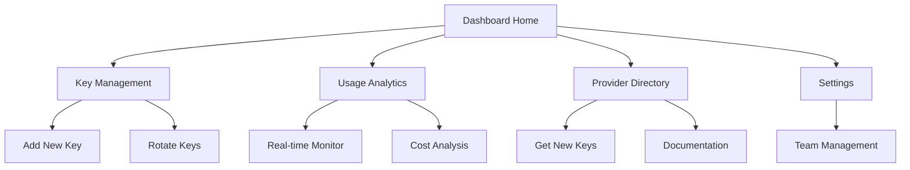

## 1. Product Overview
A comprehensive API Key Management Dashboard designed for developers to efficiently manage, monitor, and rotate API keys across multiple AI providers including OpenAI, Anthropic, Google Gemini, OpenRouter, GitHub, and more. The dashboard provides real-time usage tracking, free tier monitoring, one-click clipboard functionality, and integrated access to provider documentation.

This solution addresses the critical need for developers to manage multiple API keys securely while optimizing usage within free tier limits and maintaining seamless development workflows.

## 2. Core Features

### 2.1 User Roles
| Role | Registration Method | Core Permissions |
|------|---------------------|------------------|
| Developer | Local setup/GitHub OAuth | Full access to all key management features |
| Team Member | Invitation-based | Limited access to shared keys and usage monitoring |
| Admin | System configuration | Full system access, user management, security settings |

### 2.2 Feature Module
Our API Key Management Dashboard consists of the following main pages:
1. **Dashboard Home**: Real-time usage overview, key status indicators, quick actions panel
2. **Key Management**: Add/edit/delete keys, provider configuration, key rotation settings
3. **Usage Analytics**: Detailed usage charts, cost tracking, limit monitoring, alerts
4. **Provider Directory**: Direct links to get new keys, documentation, pricing information
5. **Settings**: Security preferences, backup/export, team management
6. **Documentation**: Integration guides, recreation prompts, troubleshooting

### 2.3 Page Details
| Page Name | Module Name | Feature description |
|-----------|-------------|---------------------|
| Dashboard Home | Quick Stats Panel | Display real-time usage across all providers, remaining quotas, active keys count |
| Dashboard Home | Key Status Grid | Show health status of each API key with color-coded indicators (active/expired/limited) |
| Dashboard Home | Quick Actions | One-click copy buttons for each provider key, quick key rotation, emergency disable |
| Key Management | Provider Setup | Add new API keys for OpenAI, Anthropic, Google Gemini, OpenRouter, GitHub, Qwen |
| Key Management | Key Rotation | Automated and manual key rotation with backup key management |
| Key Management | Security Settings | Key encryption, access logs, permission management |
| Usage Analytics | Real-time Monitor | Live usage tracking with WebSocket connections, rate limit monitoring |
| Usage Analytics | Cost Optimization | Usage patterns analysis, cost per provider, optimization recommendations |
| Usage Analytics | Alerts System | Configurable alerts for usage thresholds, key expiration, rate limits |
| Provider Directory | Quick Access Links | Direct links to provider dashboards, key generation pages, documentation |
| Provider Directory | Integration Guides | Step-by-step setup guides for each provider with code examples |
| Settings | Backup & Export | Export key configurations, backup settings, import from other tools |
| Settings | Team Management | Share keys with team members, permission controls, audit logs |
| Documentation | Recreation Prompts | Complete prompts to recreate the dashboard, technical specifications |
| Documentation | API Reference | Integration examples, webhook setup, automation scripts |

## 3. Core Process
**Developer Workflow:**
1. Developer accesses dashboard and views real-time usage overview
2. Adds new API keys through provider-specific setup forms
3. Configures usage alerts and rotation schedules
4. Uses one-click copy functionality during development
5. Monitors usage analytics and optimizes key usage
6. Rotates keys when approaching limits or for security

**Team Collaboration Flow:**
1. Admin sets up shared keys and team permissions
2. Team members access shared keys with appropriate permissions
3. Usage is tracked per team member with consolidated reporting
4. Automated alerts notify team of usage thresholds

## 4. User Interface Design
### 4.1 Design Style
- **Primary Colors**: Deep blue (#1e40af) and emerald green (#059669) for trust and growth
- **Secondary Colors**: Slate gray (#64748b) and amber (#f59e0b) for warnings
- **Button Style**: Rounded corners with subtle shadows, gradient backgrounds for primary actions
- **Font**: Inter for headings (16-24px), Source Code Pro for API keys and code (12-14px)
- **Layout Style**: Card-based design with clean spacing, top navigation with sidebar for quick access
- **Icons**: Lucide icons for consistency, provider logos for brand recognition

### 4.2 Page Design Overview
| Page Name | Module Name | UI Elements |
|-----------|-------------|-------------|
| Dashboard Home | Quick Stats Panel | Grid layout with metric cards, real-time counters, progress bars for usage limits |
| Dashboard Home | Key Status Grid | Color-coded status badges (green/yellow/red), provider logos, copy buttons with animation |
| Key Management | Provider Setup | Tabbed interface for each provider, form validation, secure input fields with masking |
| Usage Analytics | Real-time Monitor | Live updating charts using Chart.js, WebSocket indicators, refresh controls |
| Provider Directory | Quick Access | Card layout with provider branding, external link icons, integration status indicators |

### 4.3 Responsiveness
Desktop-first design with mobile-adaptive breakpoints. Touch-optimized copy buttons and swipe gestures for mobile key management. Responsive grid layouts that stack on smaller screens while maintaining functionality.