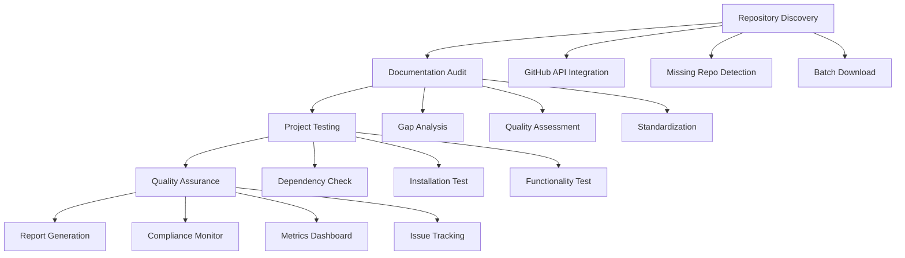

# Repository Audit Implementation Guide

## 1. Product Overview

Detailed implementation guide for executing the comprehensive GitHub repository audit strategy. This guide provides step-by-step instructions, scripts, and checklists for systematically auditing and improving 100+ repositories.

## 2. Core Features

### 2.1 User Roles

| Role                   | Registration Method | Core Permissions                                              |
| ---------------------- | ------------------- | ------------------------------------------------------------- |
| Repository Owner       | Direct access       | Full audit execution, documentation creation, project testing |
| Documentation Reviewer | Assigned access     | Review and validate documentation quality                     |
| Technical Auditor      | Assigned access     | Code review, security assessment, functionality testing       |

### 2.2 Feature Module

Our repository audit implementation consists of the following main components:

1. **Repository Discovery Page**: GitHub API integration, missing repository identification, local inventory management
2. **Documentation Audit Page**: Documentation gap analysis, quality assessment, standardization tracking
3. **Project Testing Page**: Functionality verification, dependency checking, security scanning
4. **Quality Assurance Page**: Compliance checking, metrics tracking, report generation
5. **Template Management Page**: Documentation templates, standardization tools, automation scripts

### 2.3 Page Details

| Page Name            | Module Name             | Feature Description                                                                 |
| -------------------- | ----------------------- | ----------------------------------------------------------------------------------- |
| Repository Discovery | GitHub Integration      | Connect to GitHub API, fetch complete repository list, compare with local inventory |
| Repository Discovery | Missing Repo Detector   | Identify repositories not cloned locally, prioritize download queue                 |
| Repository Discovery | Batch Downloader        | Automated cloning of missing repositories with proper organization                  |
| Documentation Audit  | Gap Analysis Scanner    | Scan all repositories for missing documentation files, generate gap reports         |
| Documentation Audit  | Quality Assessor        | Evaluate existing documentation against quality criteria, score completeness        |
| Documentation Audit  | Standardization Tracker | Monitor compliance with documentation standards, track progress                     |
| Project Testing      | Dependency Checker      | Verify all project dependencies, identify outdated or vulnerable packages           |
| Project Testing      | Installation Validator  | Test installation process for each project, document issues                         |
| Project Testing      | Functionality Tester    | Execute core features, validate against documentation claims                        |
| Quality Assurance    | Compliance Monitor      | Check adherence to documentation and code quality standards                         |
| Quality Assurance    | Metrics Dashboard       | Track audit progress, quality scores, completion rates                              |
| Quality Assurance    | Report Generator        | Create comprehensive audit reports, issue summaries                                 |
| Template Management  | Documentation Templates | Provide standardized templates for all documentation types                          |
| Template Management  | Automation Scripts      | Generate boilerplate documentation, update existing files                           |

## 3. Core Process

### Repository Owner Flow

1. **Discovery Phase**: Execute repository discovery to identify missing repos → Download missing repositories → Organize repository structure
2. **Documentation Phase**: Run documentation gap analysis → Apply standardized templates → Review and enhance existing documentation
3. **Testing Phase**: Execute dependency checks → Validate installation processes → Test core functionality
4. **Quality Assurance**: Run compliance checks → Generate audit reports → Address identified issues

### Documentation Reviewer Flow

1. **Review Assignment**: Receive documentation review assignments → Access quality assessment tools → Review documentation against standards
2. **Quality Validation**: Evaluate completeness and accuracy → Provide feedback and recommendations → Approve or request revisions

### Technical Auditor Flow

1. **Technical Assessment**: Conduct code quality reviews → Perform security assessments → Validate technical documentation
2. **Testing Validation**: Verify functionality tests → Validate performance claims → Approve technical compliance

## 4. User Interface Design

### 4.1 Design Style

* **Primary Colors**: #2563eb (blue), #059669 (green), #dc2626 (red)

* **Secondary Colors**: #64748b (gray), #f8fafc (light gray)

* **Button Style**: Rounded corners with subtle shadows, hover effects

* **Font**: Inter, 14px base size, 16px for headings

* **Layout Style**: Card-based design with clean spacing, sidebar navigation

* **Icons**: Heroicons for consistency, status indicators with color coding

### 4.2 Page Design Overview

| Page Name            | Module Name        | UI Elements                                                                                 |
| -------------------- | ------------------ | ------------------------------------------------------------------------------------------- |
| Repository Discovery | GitHub Integration | Connection status indicator, API rate limit display, repository count badges                |
| Repository Discovery | Missing Repo List  | Sortable table with priority indicators, batch selection checkboxes, download progress bars |
| Documentation        |                    |                                                                                             |

